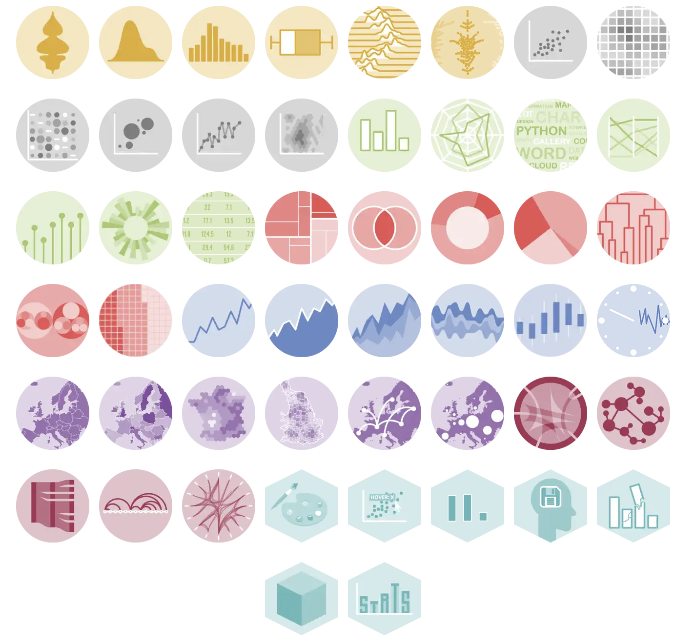

\

\

\

```{r, echo=FALSE, out.width="50%", fig.align="center"}
knitr::include_graphics("logo_top.png")
```

\newpage

# Table of contents \

- [Acknowledgements](#acknowledgements) \
- [Abstract](#abstract) \
- [Introduction](#introduction) \
- [R package: Lifelihood](#r-package-lifelihood)
   - [The Lifelihood framework](#the-lifelihood-framework)
   - [Origin of the project](#origin-of-the-project)
   - [Objectives](#objectives)
   - [Implementation](#implementation) \
- [Advanced data visualization](#advanced-data-visualization) \
- [Interactive web projects](#interactive-web-projects) \
- [Conclusion](#conclusion) \
- [References](#references)

\newpage

# Acknowledgements

TODO

\newpage

# Abstract

TODO

\newpage

# Introduction

TODO

\newpage

# R package: Lifelihood

## Origin of the project

TODO

## The Lifelihood framework

TODO

## Objectives

TODO

## Implementation

TODO

\newpage

# Data visualization

## The Python Graph Gallery

### About

The Python Graph Gallery, or python-graph-gallery.com, is a website that displays hundreds of charts made with python. It is a great resource for data visualization, as it provides a wide range of examples and code snippets to help users create their own charts. The gallery is organized by chart type, making it easy to find examples of the specific type of chart.



### Chart Sections

Each section includes a various set of variation of the same chart, with different level of complexity and customization. An important part of my work was to implement new type of charts or missing use cases.

For example, the "Histogram" section has examples of simple histogram, how to change colors, number of bins, transparency, how to split histogram with another variable, how to smooth it, which libraries is the best for each use case, etc.

### Information Design

The Python Graph Gallery stands out as the premier online resource boasting the most comprehensive collection of advanced, real-world applications of information design. Information design focuses on crafting information presentations that are both clear and easily understandable. This discipline is crucial to data visualization, enhancing the interpretation of complex data and significantly amplifying the impact of information across different charts.

An important part of my work was to fill the gallery with 


## The R Graph Gallery

\newpage

# Interactive web projects

TODO

\newpage

# Conclusion

TODO

\newpage

# References

TODO